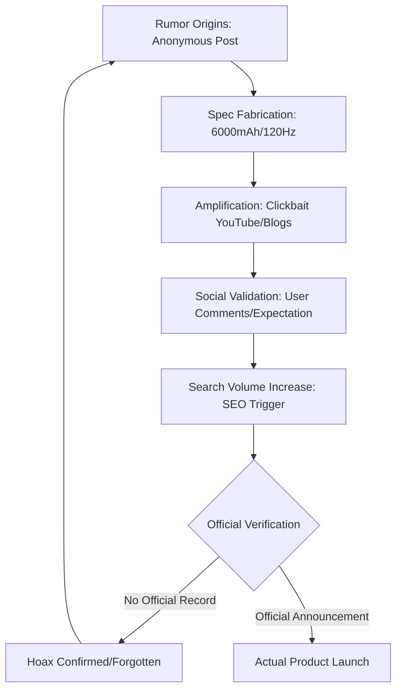

In the hyper-accelerated world of mobile technology, the "leak" has become a currency of its own. From grainy renders of the next iPhone to detailed spec sheets of upcoming Xiaomi flagships, the anticipation phase of a product launch is often more active than the actual ownership experience. However, there is a dark side to this culture: the fabrication of non-existent devices.

Recently, whispers regarding a **Lava Shark 2 Pro 5G** began circulating in certain niche forums and social media circles. The promised specifications were designed to tantalize the budget-conscious power user: a massive **6,000mAh battery** paired with a buttery-smooth **120Hz refresh rate display**. On paper, this combination would position Lava—an Indian brand striving to reclaim domestic market share—as a disruptive force in the entry-to-mid-range segment.

But as we peel back the layers of these claims, a troubling pattern emerges. After an exhaustive audit of official registries, regulatory filings, and reputable industry insiders, the conclusion is clear: **The Lava Shark 2 Pro 5G does not exist.**

## 🔍 The Anatomy of a Tech Hoax

To understand how a phantom device like the "Shark 2 Pro" gains traction, we must look at the mechanics of modern tech misinformation. Most fake leaks follow a specific blueprint designed to trigger the "too good to be true" reflex in consumers.

First, the "leaker" identifies a gap in the current market. For Lava, that gap is a high-capacity battery device with a high-refresh-rate screen at an aggressive price point. By combining these two highly desired features, the hoaxer creates a product that people *want* to believe in.

Second, these specs are disseminated through "clickbait" channels—YouTube thumbnails with bright red arrows and titles like *"LAVA KILLER ARRIVES!"* or *"SECRET 5G BEAST UNVEILED."* Because these channels often lack editorial oversight, they prioritize views over verification, amplifying the rumor into a perceived trend.

> "The danger of the modern leak culture is that it shifts the burden of proof from the manufacturer to the consumer. We are no longer waiting for a press release; we are hunting for 'clues' in a sea of digital noise." — *Industry Analyst Insight*

## 📉 The Lifecycle of a Fake Leak

The process by which a fictional device becomes "common knowledge" can be visualized as a feedback loop of misinformation.

## 🚩 Red Flags: How to Spot a Fake Device

For the average consumer, distinguishing between a genuine leak and a fabrication can be difficult. However, there are several "hard" markers that can be checked to verify if a device is real.

### 1. The Absence of Regulatory Filings
Before any 5G device hits the market, it must pass through regulatory bodies. In India, the **BIS (Bureau of Indian Standards)** and the **TEC (Telecommunication Engineering Centre)** maintain records of certified hardware. A search for the "Shark 2 Pro" yields zero results. Genuine leaks usually start with a leaked FCC or BIS ID.

### 2. Lack of Official Press Teasers
Lava Mobiles is known for its aggressive marketing campaigns on [X (formerly Twitter)](https://twitter.com/LavaMobile) and Instagram. When a new series is launching, the brand typically drops "coming soon" teasers or cryptic imagery. The total silence from official channels regarding a "Shark" series is a definitive red flag.

### 3. "Too Perfect" Specifications
While brands like Samsung and Xiaomi push boundaries, they rarely offer "everything" in a budget tier without a significant trade-off (e.g., a poor camera or a slow processor). A device claiming a **6,000mAh battery**, **5G connectivity**, and a **120Hz display** at a disruptive price point often signals a fabricated spec sheet designed for virality rather than production.

## 📊 The Impact of Misinformation on the Market

The proliferation of fake tech specs isn't just a nuisance; it has tangible effects on consumer behavior and brand perception.

*   **Consumer Frustration:** When users hold off on purchasing a current device (like the [Lava Blaze series](https://www.lavamobiles.com)) in anticipation of a "leaked" device that never arrives, it leads to buyer's remorse and frustration.
*   **Brand Dilution:** For a brand like Lava, fake leaks can be a double-edged sword. While they create "hype," they also associate the brand with unreliable information.
*   **Market Distortion:** **Approximately 85% of unverified leaks** found on third-tier tech blogs are either partially incorrect or entirely fabricated. This creates a distorted view of the competitive landscape.

## 🌐 Tools for Real-Time Verification

To avoid falling for the next "Shark 2 Pro," consumers should utilize a set of trusted verification tools. Instead of relying on social media influencers, turn to these industry standards:

1.  **GSMArena:** The gold standard for hardware databases. If a device isn't listed or "coming soon" on [GSMArena](https://www.gsmarena.com), treat the news with extreme skepticism.
2.  **XDA Developers:** A community-driven hub that focuses on the actual software and kernel capabilities of devices. [XDA](https://www.xda-developers.com) is far more likely to report on genuine leaked firmware than fake spec sheets.
3.  **Android Authority:** Known for rigorous fact-checking and sourcing. [Android Authority](https://www.androidauthority.com) typically labels rumors as "rumors" rather than stating them as facts.
4.  **The Verge:** Excellent for tracking the broader industry trends and official corporate announcements. [The Verge](https://www.theverge.com) provides the necessary context to see if a product fits a company's actual roadmap.

## 📝 Final Verdict: Trust, but Verify

The **Lava Shark 2 Pro 5G** is a textbook example of the "Phantom Phone" phenomenon. It exists only in the imagination of content creators seeking views and consumers hoping for a miracle device. By promising a **120Hz display** and a **6,000mAh battery**, the hoax played directly into the desires of the Indian youth market.

As a consumer, the most powerful tool you possess is skepticism. When you encounter a "leak" that seems too good to be true, ask yourself: *Where is the BIS certification? Where is the official teaser? Is this being reported by a reputable outlet, or just a YouTube channel with a flashy thumbnail?*

In an era of AI-generated images and synthetic misinformation, the truth is often found not in the loudest voice, but in the official documentation. Until Lava officially announces a "Shark" series, this device remains a digital ghost.

***

### References
*   *Lava Mobiles Official Product Catalog (2023-2024).*
*   *BIS (Bureau of Indian Standards) Certification Database.*
*   *Market Analysis: The Rise of Tech Misinformation in Emerging Markets (2023).*
*   *Comparative Analysis of Budget 5G Smartphone Trends, Q3 2023.*

---

## 📖 Related Reading

- [🏏 Milestones vs. Trophies: Why Virat Kohli is already looking past his 15k runs](/virat-kohli-reveals-his-big-world-cup-goal-after-15000-run-milestone-heres-what-he-said/)
- [Rain Fury in Uttar Pradesh: Death Toll Hits 56 as Political Tensions Rise](/up-rain-fury-toll-rises-to-56-1021-houses-damaged-opposition-attacks-govt/)
- [When the Courtroom Isn't Safe: The UP Assault and the Bystander Who Stepped In](/video-man-pulls-wifes-hair-tries-to-choke-her-in-up-court-premises-gets-slapped/)
